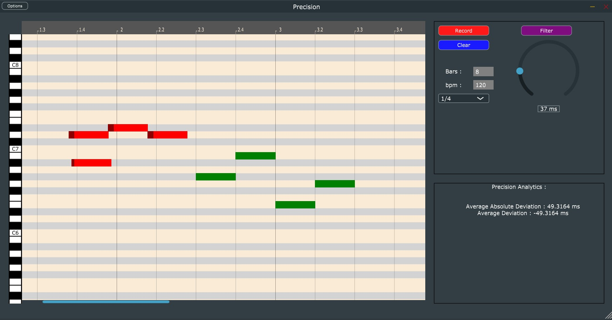

# precision

A VST3 Plugin & Standalone app to practice & analyze rhythmic precision, made with the JUCE framework.\
Supports only MIDI input for now, I might make an audio version someday.

# Install
Get the executable & plug-in files from Builds/Visual Studio 2022/x64/Release
